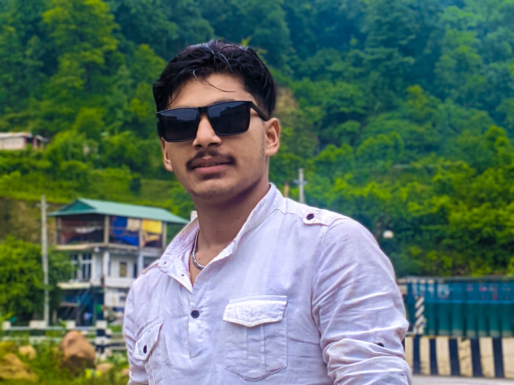

<!DOCTYPE html>
<html lang="en">

<head>
    <meta charset="UTF-8">
    <meta name="viewport" content="width=device-width, initial-scale=1.0">
    <title>My Resume</title>
    <link rel="stylesheet" href="https://cdnjs.cloudflare.com/ajax/libs/font-awesome/6.5.0/css/all.min.css">
    <link rel="stylesheet" href="index.css">
</head>

<body >
    

        

            
        

        

            <h1 style="padding-top: 10px;">Rohit Pal</h1>
            
Computer Science Student

        

        

            <h2>Profile</h2>
            

                
I'm extremely motivated and passionate about my profession which I am chosen about. I am quite
                    eligible to handle unfavorable circumstances with a calm and peaceful mind. I have good
                    communication and manipulating skills which provide a plus point to convey my view and thoughts to
                    others. I'm a highly deserving candidate with excellent academic qualifications. Volunteering,
                    teaching, and singing are a few of my hobbies which provide me strength and confidence to be the
                    best in my job.

            

        

        

            <h2>Education</h2>
            

                
<strong>2018 AD:</strong> Dewal Higher Secondary School

            

            

                
<strong>2018 - 2020 AD:</strong>Morning Glory Secondary
                    School
                    Katan, Mahendranagar
                    I.Sc with CGPA 2.9
                

            

        

        

            
<strong>2021 AD-Present:</strong>Siddhanath Science Campus
                Mahendranagar
                B.Sc. CSIT 6th semester running
            

        

        

            <h2>Work Experience</h2>
            

                
<strong>Project Lead</strong> <a
                        href="https://www.facebook.com/CodeForChangeNepal">Code For Change</a> [2024-Present]

            

            
Actively engaged with
                community stakeholders to
                gather feedback, address
                concerns, and ensure project
                relevance
            

            

                
<strong>President </strong> <a
                        href="https://www.facebook.com/profile.php?id=100089747206292">SNSC ECO-CLUB </a> [2023-2024]
                

            

            
Led environmental initiatives,
                ensuring successful execution
                and goal achievement.
            

            

                
<strong>Tech Lead</strong> <a
                        href="https://www.facebook.com/snscitclub/">SNSC IT-CLUB</a> [July,2023-2024]

            

            
Designed advertising
                templates; orchestrated techrelated seminars and
                workshops.

            

            

                
<strong>Math Teacher</a></u></strong> <a
                        href="https://www.facebook.com/groups/281886186839250/">Superlink Institute</a> [2022-Present]
                

            

            
Delivered comprehensive
                math lessons ; managed
                classroom dynamics.

            

            

                
<strong>Math Teacher</a></u></strong> <a
                        href="https://www.facebook.com/MorningGloryMahendranagar"> Morning Glory Secondary School </a>
                    [2020-2023]

            

            
Developed curriculum plans
                aligned with standard;
                conducted assessments.

            

        

        

            <h2>Skills</h2>
            

                <ul>
                    <li>HTML,CSS, Javascript</li>
                    <li>Leadershipt</li>
                    <li>Proficient is using tools such as
                        Canva, Figma, Corel Draw</li>
                    <li>Teamwork</li>
                    <li>Public Speaking</li>
                    <li>Creativity</li>
                </ul>
            

        

        

            <h2>Awards</h2>
            

                
<b>CERTICICATE OF COMPLETION
                </b> As member of Code For Change Farwest, Code For Change.

            

            

                
<b>CERTICICATE OF APPRECIATION
                </b> For being mentor of 7-day Cprogramming workshop, Code For Change.

            

            

                
<b>CERTICICATE OF PARTICIPATION 
                </b> in codefest ideathone Farwest 2023(CFC Nepal)

            

            

                
<b>CERTICICATE OF MENTOR
                </b> 1 Days CANVA Designing (Siddhanath Science Campus)

            

        

        

            <h2>Language</h2>
            

                <ul>
                    <li>English</li>
                    <li>Nepali</li>
                    <li>Hindi</li>
                    <li>Doteli</li>
                </ul>
            

            <footer class="footer">
                
<i class="fas fa-phone"></i> 9862461015

                
<i class="fas fa-envelope"></i> palrohit2425@gmail.com

                
<i class="fab fa-linkedin"></i> <a href="https://www.linkedin.com/in/rohit-pal-a78">LinkedIn</a>

                
<i class="fab fa-facebook"></i> <a href="https://www.facebook.com/profile.php?id=100050305365261">Facebook</a>

            </footer>
            
    

    

   
</body>

</html>
